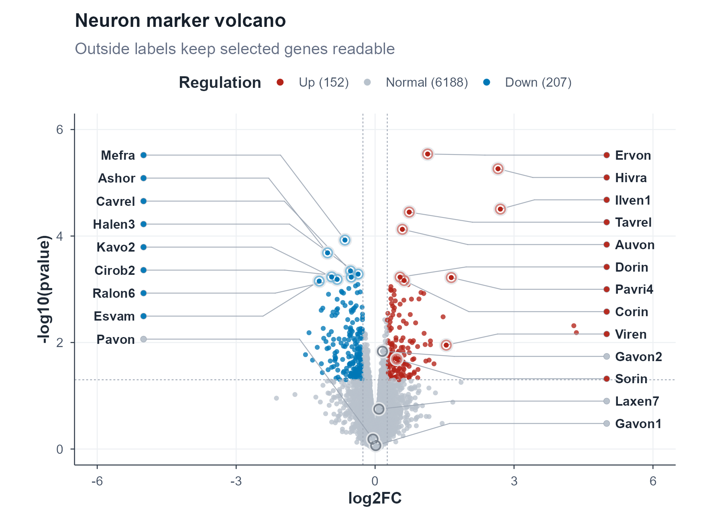

# volcanolabel

`volcanolabel` builds polished volcano plots for differential expression
figures from plotting-ready columns. Its main design choice is ordered outside
label columns: selected genes stay readable in dense plots, while compact elbow
connectors show exactly which points they belong to.

This is meant to feel familiar if you have used `ggplot2` or `ggVolcano`, but
with stronger defaults for label-heavy figures. The package does not read input
files, transform p-values, classify genes, or decide which genes should be
labelled; those analysis choices stay in your own workflow.



## Install

From GitHub:

```r
install.packages("remotes", repos = "https://cloud.r-project.org")
remotes::install_github("XiaoLi1991-star/volcanolabel")
```

From a local checkout:

```r
install.packages("remotes", repos = "https://cloud.r-project.org")
remotes::install_local("volcanolabel")
```

## Quick Start

Prepare the analysis columns yourself, then pass them to `volcano_plot()`.
The minimum useful inputs are:

- an x position, usually log2 fold change;
- a y position, usually `-log10(p)`;
- an optional point group/color column;
- an optional label column, with `NA` or `""` for rows that should not be labelled.

The bundled table is only demonstration data. Gene identifiers have been
anonymized, while the numeric plotting columns are kept useful for layout
testing.

```r
library(volcanolabel)

expr <- read.table(
  system.file("extdata", "gene_expression.txt", package = "volcanolabel"),
  header = TRUE,
  sep = "\t",
  stringsAsFactors = FALSE,
  check.names = FALSE
)

x_cutoff <- log2(1.2)
y_cutoff <- -log10(0.05)
genes_to_label <- c(
  "Mefra", "Ashor", "Cavrel", "Halen3", "Kavo2", "Cirob2", "Ralon6", "Esvam", "Pavon",
  "Ervon", "Hivra", "Ilven1", "Tavrel", "Auvon", "Dorin", "Pavri4", "Corin",
  "Viren", "Gavon2", "Sorin", "Laxen7", "Gavon1"
)
custom_palette <- c(
  Up = "#B42318",
  Normal = "#B8C2CC",
  Down = "#0077B6"
)

expr$neg_log10_p <- -log10(pmax(expr$pvalue, .Machine$double.xmin))
expr$Regulation <- ifelse(
  expr$log2FC >= x_cutoff & expr$neg_log10_p >= y_cutoff,
  "Up",
  ifelse(expr$log2FC <= -x_cutoff & expr$neg_log10_p >= y_cutoff, "Down", "Normal")
)
expr$plot_label <- ifelse(expr$gene %in% genes_to_label, expr$gene, NA_character_)

p <- volcano_plot(
  expr,
  x = "log2FC",
  y = "neg_log10_p",
  label = "plot_label",
  color = "Regulation",
  palette = custom_palette,
  x_cutoff = x_cutoff,
  y_cutoff = y_cutoff,
  label_point_ring_halo_color = "#E5E7EB",
  label_point_ring_halo_alpha = 0.93,
  label_point_ring_color = "auto",
  label_point_ring_normal_color = "auto",
  label_point_ring_alpha = 0.95,
  label_anchor_x_left = -5.0,
  label_anchor_x_right = 5.0,
  plot_xmax = 5.9,
  xlab = "log2FC",
  ylab = "-log10(pvalue)",
  title = "Neuron marker volcano",
  subtitle = "Outside labels keep selected genes readable"
)

save_volcano(p, "volcano_plot.png", width = 7.4, height = 5.4)
save_volcano(p, "volcano_plot.pdf", width = 7.4, height = 5.4)
```

## Custom Colors

Custom palettes are named vectors. `label_point_ring_color = "auto"` derives a
visible same-family ring from each group color, including `Up`, `Down`, and
`Normal`. Use `"group"` when you want the ring to exactly match the point group.
The small dots beside outside labels stay in the original group colors; the
adaptive ring is drawn around the labelled source point in the point cloud.

```r
custom_palette <- c(
  Up = "#B42318",
  Normal = "#DDEAF7",
  Down = "#0077B6"
)

p <- volcano_plot(
  expr,
  x = "log2FC",
  y = "neg_log10_p",
  label = "plot_label",
  color = "Regulation",
  palette = custom_palette,
  x_cutoff = x_cutoff,
  y_cutoff = y_cutoff,
  label_point_ring_color = "auto"
)
```

## What Makes It Different

- Ordered outside label columns instead of relying only on in-panel repel text.
- Smart layout planning: label wrapping, line caps, x-range expansion, side
  anchors, and vertical spacing adapt to label length, label density, and point
  position.
- Label text can be placed outside or inside each side's anchor column as one
  consistent side-level decision, reducing wasted left/right whitespace.
- No white label boxes: labels are drawn as text with compact elbow connectors,
  so selected labels do not hide neighboring points with a background panel.
- Labelled source points get a two-layer ring by default: a narrow light halo
  plus a group-aware inner ring. `label_point_ring_color = "auto"` follows the
  palette and derives a higher-contrast ring from each group color, so labelled
  points stay visible inside dense same-color point clouds even after you
  change palettes. Use `label_point_ring_color = "group"` for exact group
  colors.
- Threshold cutoffs are visual guides only; the package never reclassifies your
  data.
- Counted legends, flexible palettes, and publication-ready defaults.

## Data Contract

`volcanolabel` is intentionally a plotting package. It does not:

- read differential expression files;
- calculate fold changes or p-values;
- convert p-values to `-log10(p)`;
- classify genes as up/down/normal;
- decide which genes are biologically important enough to label.

That makes the plotting layer predictable: any table-like object that already
contains numeric x/y columns can be used, whether it came from Seurat, DESeq2,
edgeR, limma, Scanpy, or a custom workflow.

## Main API

- `volcano_plot()` returns a ggplot object from plotting-ready columns.
- `compute_outside_label_layout()` creates the label columns and connector
  geometry.
- `wrap_volcano_labels()` wraps and caps long label text.
- `volcano_palette()` returns the built-in `Up`, `Normal`, and `Down` palette.
- `theme_volcano()` provides the default theme.
- `save_volcano()` writes PNG, PDF, SVG, or any other `ggsave()` output.

By default, `label_wrap_width = "auto"` and `label_max_lines = "auto"`. Sparse
long labels get more room; dense long labels are compacted with ellipses and
short suffixes so repeated truncated labels stay distinguishable.

## WeChat Article Kit

The repository includes a user-facing Chinese HTML guide and prepared article
figures under `docs/wechat/`. The image manifest lists the confirmed dimensions
for cover images, share cards, square covers, and in-article figures.

## License

MIT. The R package keeps the standard CRAN-style `LICENSE` stub and includes the
full MIT text in `LICENSE.md`.

## Release Checks

Before publishing the package, it was checked with:

```r
devtools::test("volcanolabel")
R CMD build volcanolabel
R CMD check --no-manual --no-build-vignettes volcanolabel_0.1.1.tar.gz
```

The visual regression checks include a direct label-over-point case to guard
against white label backgrounds covering dense points.
